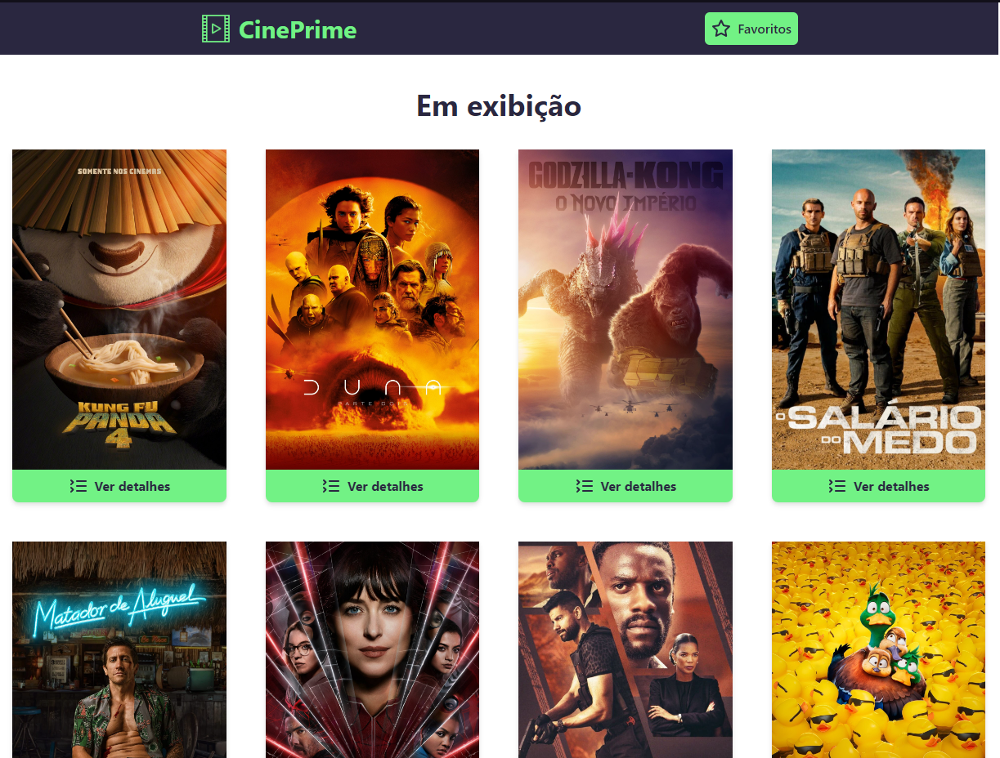
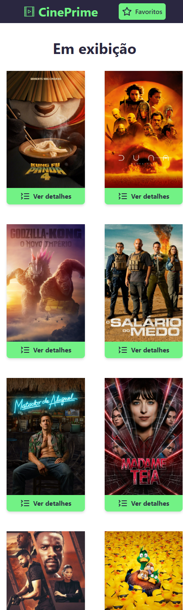

# Projeto CinePrime
O CinePrime foi um projeto desenvolvido com o intuito de aplicar conhecimentos iniciais sobre requisição de API e navegação entre páginas (rotas). No aplicativo, os usuários podem acessar informações sobre diversos filmes, visualizar sinopses e assistir aos trailers de cada um. Além disso, há uma funcionalidade de lista de favoritos, na qual é possível adicionar e remover filmes. Os principais desafios encontrados durante o desenvolvimento do projeto foram a implementação da requisição de API e a compreensão da lógica de funcionamento. Foi através desse projeto que pude colocar em prática os ensinamentos de React.js do curso ministrado pelo Matheus Fraga, do Sujeito Programador. Também foi onde testei o Tailwind CSS, um framework de CSS que realmente é fantástico e que pretendo utilizar mais vezes.

 ## 👨‍💻 O que eu aprendi
* Utilizar `react-router-dom` para definir os caminhos e lidar com rotas não encontradas (erro 404).
* Usar `axios` para requisição HTTP.
* Utilizar `Hooks` para renderizar o conteúdo na tela e armazenar os filmes no LocalStorage.
* empregar `react-toastify` para customizar as notificações.
* Usei o `Tailwind CSS` para estilizar as páginas no próprio HTML(Amei esse framework)
* `react-toastify` para estilizar os alerts.
* Utilizar icones personalizados do `lucide-react`.

### Screenshot

#### Version Desktop

#### Version Mobile

### 📦 Tecnologias usadas

## 👷 Autores

* **Guilherme Alves Silva** - *Desenvolvedor do Projeto* - [GuilhermeAlves](https://github.com/bitsbygui)

  
## 📄 Licença

Esse projeto está sob a licença (MIT) - acesse os detalhes [LICENSE.md](https://github.com/git/git-scm.com/blob/main/MIT-LICENSE.txt).

## 💡 Expressões de gratidão

* Um agradecimento publicamente.
* Para suporte, mande um email para guilhermealvesskr@gmail.com.
* Link para o seu linkedin [Meu linkedin]([https://url_do_link](https://www.linkedin.com/in/guilhermealvessilva/)https://www.linkedin.com/in/guilhermealvessilva/)
